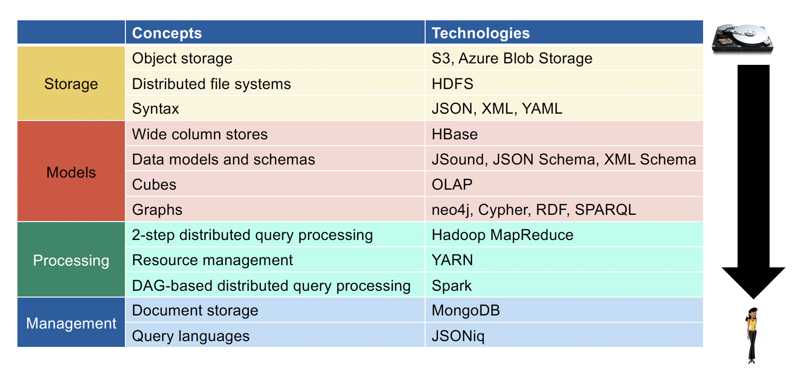
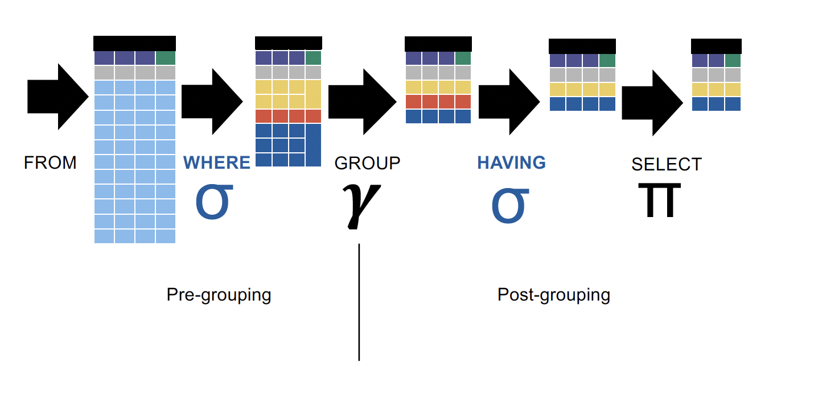
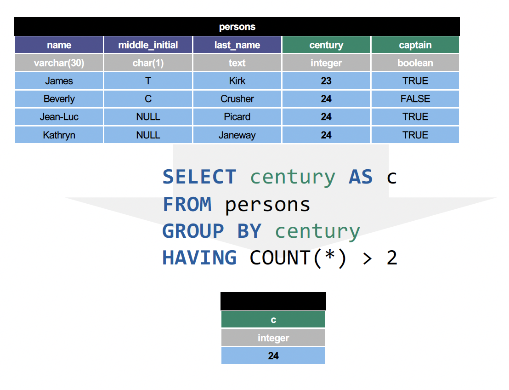
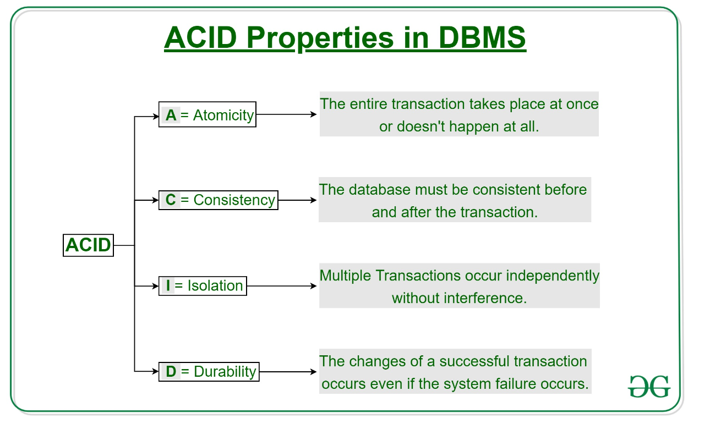
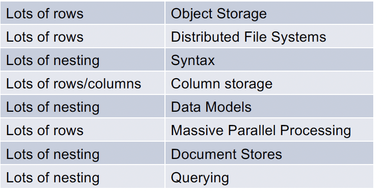

# 2023_12_11 introduction 

initialise my onw exercise repository to correct commit -m 

the excice use docker to building envrioemnt, but I should do everything step by myself.
or learn the docker myself as mention in the introduction and then check what's the meaning of each dockerfile 
"Self-study: Docker for your laptop, Azure for large-scale clusters"
progress.md (END)

## exercise 
 enviromemnt set up

# 2023_12_13 lessons learnt:  SQL 
this is basicl database knowledge (SQL)
read provided textbook 

Data independence : 
    logical data mode : table (maily), doesnt change , other like trees, graph, cude 
    physical storgae : various 
directly use python and R is not best option as it dont follow the Data independence 

Over architecture: 
language:     SQL
model  :      table 
compute:      cpu 
Storage:      disk 

relational table: 
Atrribute;column;Field;Property 
Primary key;Row ID; Name
Row;Businesss Object;Item;entity;Document;Record

table as a (mathematic) relation :  a subset of the Cartesian product
of the domains
A relation R is  :
1.  a set of atrribute 
2.  a extension (set of tuple)
tuple: more intuitive disvlae 
S: Atrribute
V: values

rules of relational table:
1: relational integrity:   all records have same atrributes 
2: Atomic integrity (1st normal ): no sub-table 
3: domain integrity : each column has same datatype/domain/schema

relational algebra: 
Set querys: Union, intersection, sbustrction ... 
Filter queries: selection, projection(selectin attributes)...
renaming  queries: 
joining queries: cartesian product, join (merge by matches)
grouping, sorting  ???

Normal forms: 
it means "best practice "
to make sure consistences: 
 * update anomaly 
 * delete anomaly
 * insert anomaly
1st normal form (tabular) - the key (atomic integrity): 
2nd normal form (not joined) - the whole key :  no partial dependency, the primary key fullly decide other atrribute 
3rd normal form - nothing but the key : attributes only depend on the primary key 
__but in the big data, we normally drop normal forms__

SQL brush up 
declarative language: tell what want,not how 
pronounciatin of "SQL": See-kwel or just S-Q-L

query plan

transaction : ACID
Atomicity :???
consistency 
Isolation
Durability 

__again in the big data, we normally drop normal forms__

performance: 
indices 
OLTP : online transaction procssing , write intensive
OLAP : online analytical processing, read-intensive
Mind data shape 

Data scale up 
